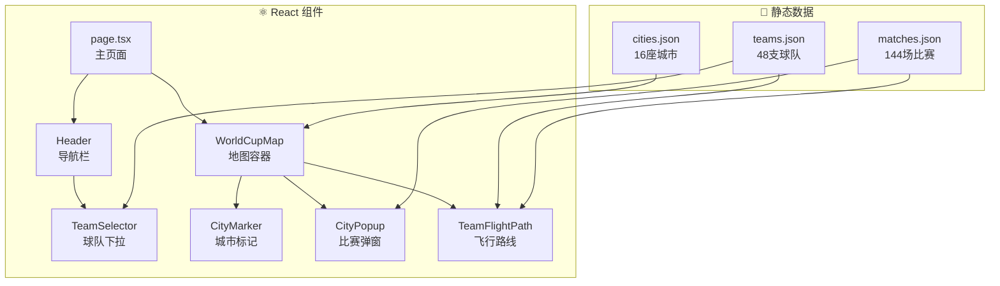

# 2026 FIFA 世界杯互动地图 - 开发步骤指南

一个展示2026年世界杯美国、加拿大、墨西哥举办城市的互动地图。用户可以按城市浏览比赛日程，或追踪球队在小组赛阶段的行程路线。

> [!IMPORTANT]
> **数据时效**：官方比赛日程将于2025年12月6日发布。初始版本将使用占位符数据，待官方数据发布后更新。

---

# 开发步骤

## Step 1: 项目初始化与环境搭建
**预计耗时：15-20分钟**

### 1.1 创建 Next.js 项目
```bash
# 进入工作目录
cd c:\cc\wc

# 创建 Next.js 14 项目（使用 App Router）
npx -y create-next-app@latest ./ --typescript --eslint --tailwind --app --src-dir --import-alias "@/*"
```

### 1.2 安装地图相关依赖
```bash
npm install leaflet react-leaflet
npm install -D @types/leaflet
```

### 1.3 验证项目能正常启动
```bash
npm run dev
```
打开浏览器访问 `http://localhost:3000`，确认看到 Next.js 默认页面。

### ✅ Step 1 完成标志
- [ ] 项目创建成功，无报错
- [ ] `npm run dev` 能正常启动
- [ ] 浏览器能访问 localhost:3000

---

## Step 2: 准备静态数据
**预计耗时：30-45分钟**

### 2.1 创建目录结构
```bash
mkdir -p src/data
```

### 2.2 创建城市数据 `src/data/cities.json`
包含16座举办城市的信息：

| 字段 | 说明 | 示例 |
|------|------|------|
| id | 唯一标识符 | "mexico_city" |
| name | 城市名称 | "Mexico City" |
| country | 国家 | "Mexico" |
| countryCode | 国家代码 | "MEX" |
| lat | 纬度 | 19.4326 |
| lng | 经度 | -99.1332 |
| venue | 体育场名称 | "Estadio Azteca" |
| capacity | 容量 | 87000 |

**16座城市列表**：
- 🇺🇸 美国 (11城): Atlanta, Boston, Dallas, Houston, Kansas City, Los Angeles, Miami, New York/New Jersey, Philadelphia, San Francisco Bay Area, Seattle
- 🇲🇽 墨西哥 (3城): Mexico City, Guadalajara, Monterrey
- 🇨🇦 加拿大 (2城): Toronto, Vancouver

### 2.3 创建球队数据 `src/data/teams.json`
包含48支球队的分组信息：
```json
{
  "code": "MEX",
  "name": "Mexico",
  "group": "A",
  "flag": "🇲🇽"
}
```

> [!TIP]
> 可从 [维基百科 2026世界杯抽签结果](https://en.wikipedia.org/wiki/2026_FIFA_World_Cup) 获取最新分组信息。

### 2.4 创建比赛数据 `src/data/matches.json`
小组赛共144场比赛（48队 × 3场）：
```json
{
  "id": 1,
  "group": "A",
  "team1": "MEX",
  "team2": "RSA",
  "cityId": "mexico_city",
  "datetime": "2026-06-11T12:00:00-05:00",
  "stage": "group"
}
```

> [!NOTE]
> 12月6日前使用占位符数据，正式日程公布后更新。

### ✅ Step 2 完成标志
- [ ] `cities.json` 包含16座城市完整信息
- [ ] `teams.json` 包含48支球队分组
- [ ] `matches.json` 包含小组赛比赛安排
- [ ] 所有 JSON 文件格式正确，无语法错误

---

## Step 3: 基础地图渲染
**预计耗时：45-60分钟**

### 3.1 创建组件目录
```bash
mkdir -p src/components
```

### 3.2 创建 `WorldCupMap.tsx` 地图容器组件
```tsx
// src/components/WorldCupMap.tsx
'use client';
import { MapContainer, TileLayer } from 'react-leaflet';
import 'leaflet/dist/leaflet.css';

export default function WorldCupMap() {
  return (
    <MapContainer
      center={[39.8283, -98.5795]} // 北美中心点
      zoom={4}
      style={{ height: '100vh', width: '100%' }}
    >
      <TileLayer
        url="https://{s}.basemaps.cartocdn.com/light_all/{z}/{x}/{y}{r}.png"
        attribution='&copy; OpenStreetMap, &copy; CartoDB'
      />
    </MapContainer>
  );
}
```

### 3.3 在页面中引入地图
修改 `src/app/page.tsx`：
```tsx
import dynamic from 'next/dynamic';

const WorldCupMap = dynamic(() => import('@/components/WorldCupMap'), {
  ssr: false, // Leaflet 不支持 SSR
  loading: () => <p>Loading map...</p>
});

export default function Home() {
  return <WorldCupMap />;
}
```

### 3.4 修复 Leaflet 图标问题
在 `WorldCupMap.tsx` 中添加：
```tsx
import L from 'leaflet';

// 修复 Leaflet 默认图标路径问题
delete (L.Icon.Default.prototype as any)._getIconUrl;
L.Icon.Default.mergeOptions({
  iconRetinaUrl: '/marker-icon-2x.png',
  iconUrl: '/marker-icon.png',
  shadowUrl: '/marker-shadow.png',
});
```

### ✅ Step 3 完成标志
- [ ] 地图正常渲染，显示北美地区
- [ ] 可以缩放和拖动地图
- [ ] 无控制台报错

---

## Step 4: 城市标记与弹窗
**预计耗时：60-90分钟**

### 4.1 创建 `CityMarker.tsx` 组件
每个城市的标记点，按国家使用不同颜色：
- 🔵 美国 - 蓝色
- 🟢 墨西哥 - 绿色
- 🔴 加拿大 - 红色

```tsx
// src/components/CityMarker.tsx
import { Marker, Tooltip } from 'react-leaflet';
import L from 'leaflet';

interface City {
  id: string;
  name: string;
  country: string;
  lat: number;
  lng: number;
  venue: string;
}

export default function CityMarker({ city, onClick }: { city: City; onClick: () => void }) {
  const getColor = () => {
    switch (city.country) {
      case 'USA': return '#1e40af';
      case 'Mexico': return '#166534';
      case 'Canada': return '#dc2626';
      default: return '#6b7280';
    }
  };

  const customIcon = L.divIcon({
    className: 'custom-marker',
    html: `<div style="background:${getColor()};width:24px;height:24px;border-radius:50%;border:3px solid white;box-shadow:0 2px 4px rgba(0,0,0,0.3)"></div>`,
  });

  return (
    <Marker position={[city.lat, city.lng]} icon={customIcon} eventHandlers={{ click: onClick }}>
      <Tooltip>{city.name}</Tooltip>
    </Marker>
  );
}
```

### 4.2 创建 `CityPopup.tsx` 模态弹窗
显示该城市的所有比赛：

```tsx
// src/components/CityPopup.tsx
interface Match {
  team1: string;
  team2: string;
  datetime: string;
}

export default function CityPopup({ city, matches, onClose }: Props) {
  return (
    <div className="popup-overlay" onClick={onClose}>
      <div className="popup-content" onClick={e => e.stopPropagation()}>
        <h2>{city.name}</h2>
        <p>{city.venue}</p>
        <ul>
          {matches.map((match, i) => (
            <li key={i}>
              {match.team1} vs {match.team2}
              <br />
              {new Date(match.datetime).toLocaleString()}
            </li>
          ))}
        </ul>
        <button onClick={onClose}>关闭</button>
      </div>
    </div>
  );
}
```

### 4.3 整合到 WorldCupMap
加载城市数据，点击标记显示弹窗。

### ✅ Step 4 完成标志
- [ ] 16个城市标记正确显示在地图上
- [ ] 三个国家的标记使用不同颜色
- [ ] 悬停显示城市名称
- [ ] 点击标记弹出比赛列表
- [ ] 可以关闭弹窗

---

## Step 5: 球队选择器与飞行路线
**预计耗时：90-120分钟**

### 5.1 创建 `TeamSelector.tsx`
下拉菜单选择球队：
```tsx
// src/components/TeamSelector.tsx
export default function TeamSelector({ teams, onSelect, selectedTeam }) {
  // 按小组分组：A-L
  const groupedTeams = groupBy(teams, 'group');
  
  return (
    <select onChange={(e) => onSelect(e.target.value)}>
      <option value="">选择球队查看行程</option>
      {Object.entries(groupedTeams).map(([group, groupTeams]) => (
        <optgroup key={group} label={`小组 ${group}`}>
          {groupTeams.map(team => (
            <option key={team.code} value={team.code}>
              {team.flag} {team.name}
            </option>
          ))}
        </optgroup>
      ))}
    </select>
  );
}
```

### 5.2 创建 `TeamFlightPath.tsx`
球队行程动画：

```tsx
// src/components/TeamFlightPath.tsx
import { Polyline, CircleMarker, Popup } from 'react-leaflet';
import { useState, useEffect } from 'react';

export default function TeamFlightPath({ team, matches, cities }) {
  const [animatedPath, setAnimatedPath] = useState([]);
  
  // 获取球队的比赛城市顺序（按时间排序）
  const teamMatches = matches
    .filter(m => m.team1 === team || m.team2 === team)
    .sort((a, b) => new Date(a.datetime) - new Date(b.datetime));
  
  // 动画逐步展示路线
  useEffect(() => {
    let index = 0;
    const interval = setInterval(() => {
      if (index < teamMatches.length) {
        setAnimatedPath(prev => [...prev, getCityCoords(teamMatches[index].cityId)]);
        index++;
      } else {
        clearInterval(interval);
      }
    }, 500);
    return () => clearInterval(interval);
  }, [team]);

  return (
    <>
      <Polyline positions={animatedPath} color="#f59e0b" weight={3} dashArray="10,5" />
      {animatedPath.map((pos, i) => (
        <CircleMarker key={i} center={pos} radius={8}>
          <Popup>比赛 {i + 1}</Popup>
        </CircleMarker>
      ))}
    </>
  );
}
```

### 5.3 创建 `Header.tsx` 导航栏
```tsx
// src/components/Header.tsx
export default function Header({ children }) {
  return (
    <header className="header">
      <h1>🏆 FIFA World Cup 2026</h1>
      <nav>{children}</nav>
    </header>
  );
}
```

### ✅ Step 5 完成标志
- [ ] 球队选择器显示48支球队，按小组分类
- [ ] 选择球队后显示动画飞行路线
- [ ] 路线按比赛时间顺序连接3座城市
- [ ] 每个落脚点可点击查看比赛详情
- [ ] 清除选择可重置地图视图

---

## Step 6: 样式美化
**预计耗时：60-90分钟**

### 6.1 更新 `globals.css`
```css
:root {
  /* 世界杯主题色 */
  --primary: #7c3aed;      /* 紫色主色 */
  --secondary: #f59e0b;    /* 金色点缀 */
  --bg-dark: #0f172a;      /* 深色背景 */
  --text-light: #f8fafc;
  
  /* 国家代表色 */
  --usa: #1e40af;
  --mexico: #166534;
  --canada: #dc2626;
}

/* 全屏地图布局 */
body {
  margin: 0;
  padding: 0;
  font-family: 'Inter', sans-serif;
}

/* 浮动导航栏 */
.header {
  position: fixed;
  top: 0;
  left: 0;
  right: 0;
  z-index: 1000;
  background: linear-gradient(to right, var(--bg-dark), rgba(15, 23, 42, 0.9));
  padding: 1rem 2rem;
  display: flex;
  justify-content: space-between;
  align-items: center;
  backdrop-filter: blur(10px);
}

/* 弹窗样式 */
.popup-overlay {
  position: fixed;
  inset: 0;
  background: rgba(0, 0, 0, 0.6);
  display: flex;
  justify-content: center;
  align-items: center;
  z-index: 2000;
}

.popup-content {
  background: white;
  border-radius: 16px;
  padding: 2rem;
  max-width: 400px;
  box-shadow: 0 25px 50px rgba(0, 0, 0, 0.25);
  animation: slideUp 0.3s ease;
}

@keyframes slideUp {
  from { transform: translateY(20px); opacity: 0; }
  to { transform: translateY(0); opacity: 1; }
}

/* 响应式 */
@media (max-width: 768px) {
  .header {
    flex-direction: column;
    gap: 1rem;
  }
}
```

### ✅ Step 6 完成标志
- [ ] 整体视觉风格统一、现代
- [ ] 导航栏浮动且透明模糊效果
- [ ] 弹窗有动画效果
- [ ] 移动端适配正常

---

## Step 7: 测试与调试
**预计耗时：30-45分钟**

### 7.1 功能测试清单
| 测试项 | 预期结果 | 实际结果 |
|--------|----------|----------|
| 首次加载 | 地图居中北美，16城市可见 | ⬜ |
| 点击城市 | 弹出该城市比赛列表 | ⬜ |
| 选择球队 | 动画展示3场比赛路线 | ⬜ |
| 路线动画 | 500ms间隔依次显示 | ⬜ |
| 移动端 | 导航栏垂直排列 | ⬜ |
| 关闭弹窗 | 点击外部或按钮关闭 | ⬜ |

### 7.2 构建验证
```bash
npm run build
npm run lint
```

### 7.3 浏览器兼容性
- [ ] Chrome
- [ ] Firefox  
- [ ] Safari
- [ ] Edge

---

## Step 8: 部署上线
**预计耗时：15-20分钟**

### 8.1 推送到 GitHub
```bash
git init
git add .
git commit -m "feat: World Cup 2026 interactive map"
git branch -M main
git remote add origin https://github.com/[用户名]/worldcup2026-map.git
git push -u origin main
```

### 8.2 部署到 Vercel
1. 访问 [vercel.com](https://vercel.com)
2. 点击 "Import Project"
3. 选择 GitHub 仓库
4. 保持默认设置，点击 "Deploy"
5. 等待2-3分钟，获取线上链接

### ✅ Step 8 完成标志
- [ ] 代码推送到 GitHub
- [ ] Vercel 部署成功
- [ ] 线上链接可正常访问

---

# 架构概览



---

# 时间估算汇总

| 步骤 | 内容 | 预计耗时 |
|------|------|----------|
| Step 1 | 项目初始化 | 15-20 分钟 |
| Step 2 | 准备数据 | 30-45 分钟 |
| Step 3 | 基础地图 | 45-60 分钟 |
| Step 4 | 城市标记弹窗 | 60-90 分钟 |
| Step 5 | 球队选择路线 | 90-120 分钟 |
| Step 6 | 样式美化 | 60-90 分钟 |
| Step 7 | 测试调试 | 30-45 分钟 |
| Step 8 | 部署上线 | 15-20 分钟 |
| **合计** | | **6-8 小时** |

> [!TIP]
> 建议分2-3个工作日完成，每天专注完成2-3个步骤。
