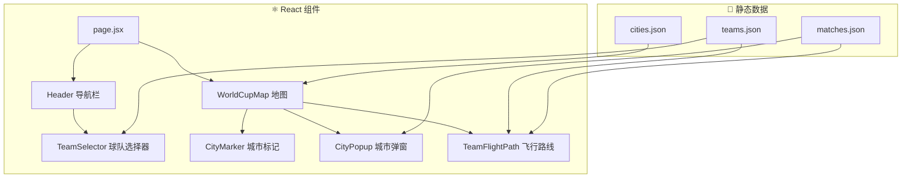

# 2026 FIFA 世界杯互动地图

一个展示2026年世界杯美国、加拿大、墨西哥举办城市的互动地图。用户可以按城市浏览比赛日程，或追踪球队在小组赛阶段的行程路线。

## 需要您确认的事项

> [!IMPORTANT]
> **数据时效**：官方比赛日程将于2025年12月6日发布。初始版本将使用占位符数据，待官方数据发布后更新。

> [!NOTE]
> **附加赛球队**：48支球队中有6支将通过2026年3月的附加赛决出。这些位置暂时显示为"待定"。

---

## 计划变更

### 项目初始化

#### [新建] [package.json](file:///c:/cc/wc/package.json)
Next.js 14 项目，包含以下依赖：
- `next`, `react`, `react-dom` - 核心框架
- `leaflet`, `react-leaflet` - 地图渲染
- 飞行路线动画（自定义实现或插件）

---

### 数据层

#### [新建] [src/data/cities.json](file:///c:/cc/wc/src/data/cities.json)
16座举办城市的坐标和场馆信息：
```json
{
  "id": "mexico_city",
  "name": "Mexico City",
  "country": "Mexico",
  "countryCode": "MEX",
  "lat": 19.4326,
  "lng": -99.1332,
  "venue": "Estadio Azteca",
  "capacity": 87000
}
```

#### [新建] [src/data/teams.json](file:///c:/cc/wc/src/data/teams.json)
48支球队及分组信息（来自12月5日抽签）：
```json
{
  "code": "MEX",
  "name": "Mexico",
  "group": "A",
  "flag": "🇲🇽"
}
```

#### [新建] [src/data/matches.json](file:///c:/cc/wc/src/data/matches.json)
小组赛比赛信息（12月6日前为占位符）：
```json
{
  "id": 1,
  "group": "A",
  "team1": "MEX",
  "team2": "RSA",
  "cityId": "mexico_city",
  "datetime": "2026-06-11T12:00:00-05:00",
  "stage": "group"
}
```

---

### 地图组件

#### [新建] [src/components/WorldCupMap.jsx](file:///c:/cc/wc/src/components/WorldCupMap.jsx)
主地图组件，使用 `react-leaflet`：
- 渲染以北美为中心的视图
- 使用 CartoDB Positron 底图（免费、简洁美观）
- 自定义城市标记点，世界杯风格
- 处理标记点点击事件

#### [新建] [src/components/CityMarker.jsx](file:///c:/cc/wc/src/components/CityMarker.jsx)
每个举办城市的自定义标记：
- 美国/加拿大/墨西哥采用不同样式
- 悬停显示城市名称
- 点击触发比赛弹窗

#### [新建] [src/components/CityPopup.jsx](file:///c:/cc/wc/src/components/CityPopup.jsx)
点击城市时的模态弹窗：
- 列出该场馆的所有小组赛
- 显示球队国旗、名称和比赛时间
- 支持关闭按钮和点击外部关闭

#### [新建] [src/components/TeamFlightPath.jsx](file:///c:/cc/wc/src/components/TeamFlightPath.jsx)
球队行程的动画折线：
- 城市间的弧线连接（大圆航线风格）
- 蛇形动画逐步展示路线
- 每个落脚点显示比赛详情弹窗

---

### UI 组件

#### [新建] [src/components/TeamSelector.jsx](file:///c:/cc/wc/src/components/TeamSelector.jsx)
球队选择下拉菜单：
- 按小组（A-L）分组
- 显示国旗表情 + 球队名称
- 选择后触发飞行路线渲染
- 清除按钮重置视图

#### [新建] [src/components/Header.jsx](file:///c:/cc/wc/src/components/Header.jsx)
顶部导航栏：
- 世界杯 2026 品牌标识
- 球队选择器置于显眼位置
- 简约现代设计

#### [新建] [src/components/MatchCard.jsx](file:///c:/cc/wc/src/components/MatchCard.jsx)
可复用的比赛展示组件：
- 球队国旗和名称
- 日期/时间格式化
- 场馆信息

---

### 样式

#### [新建] [src/app/globals.css](file:///c:/cc/wc/src/app/globals.css)
全局样式与设计系统：
- 灵感来自世界杯但更现代化的配色
- CSS 变量支持主题切换
- 响应式断点
- 平滑过渡和悬停效果

---

### 页面结构

#### [新建] [src/app/page.jsx](file:///c:/cc/wc/src/app/page.jsx)
主应用页面：
- 全屏地图布局
- 顶部导航栏覆盖层
- 管理选中球队/城市的状态

---

## 架构图



---

## 验证计划

### 自动化测试
```bash
# 构建验证
npm run build

# 代码检查
npm run lint
```

### 手动验证
1. **地图渲染**：确认所有16座城市在加载时正确显示
2. **城市弹窗**：点击每个城市标记，确认弹窗显示正确的比赛
3. **球队选择**：选择不同球队，验证飞行路线正确渲染
4. **动画效果**：确认飞行路线动画流畅
5. **响应式**：在移动端视口测试
6. **跨浏览器**：在 Chrome、Firefox、Safari 中验证

### 浏览器测试
- 访问 localhost:3000
- 交互测试所有功能
- 截图记录文档

---

## 部署

### GitHub 仓库
```bash
git init
git add .
git commit -m "Initial commit: World Cup 2026 Map"
git remote add origin https://github.com/[用户名]/worldcup2026-map.git
git push -u origin main
```

### Vercel 部署
- 将 GitHub 仓库连接到 Vercel
- 推送到 main 分支自动部署
- Next.js 项目零配置即可运行
