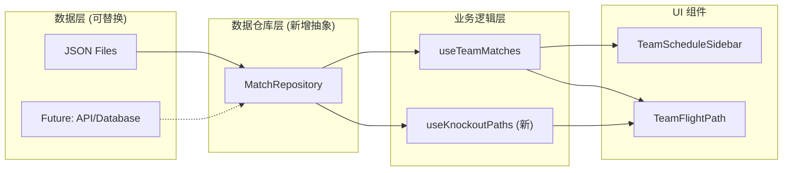

# 淘汰赛日程扩展功能 - 完整实施计划

> **用途说明**：本文档包含实施此功能所需的全部上下文信息，可在新的对话线程中作为唯一参考。

---

## 1. 项目背景

### 1.1 现有应用概述

这是一个 **2026 FIFA 世界杯互动地图应用**，使用 Next.js 16 + React 19 + Leaflet 构建，部署在 Vercel。

**核心功能**：
- 在地图上显示 16 座举办城市（美国 11 座、墨西哥 3 座、加拿大 2 座）
- 用户选择球队后，显示该队 3 场小组赛的日程和飞行路线动画
- 支持时区切换、城市详情查看

**技术栈**：
- 框架：Next.js 16 (App Router)
- UI：React 19 + Tailwind CSS 4
- 地图：Leaflet + react-leaflet
- 测试：Vitest

### 1.2 现有数据结构

```
src/data/
├── cities.json     # 16 座城市（id, name, lat, lng, venue, capacity）
├── matches.json    # 72 场小组赛（id, group, team1, team2, cityId, datetime, stage）
├── teams.json      # 48 支球队（code, name, group, flag）
└── index.ts        # 数据导出
```

**关键类型定义** (`src/types/index.ts`)：
```typescript
export interface Match {
    id: number;
    group: string;
    team1: string;
    team2: string;
    cityId: string;
    datetime: string;
    stage: string;  // 目前只有 "group"
}

export interface MatchWithCoords {
    match: Match;
    coords: [number, number];
    city: City;
}
```

### 1.3 核心组件结构

```
src/components/
├── TeamSelector.tsx           # 球队下拉选择器
├── TeamScheduleSidebar.tsx    # 右侧日程面板
├── TeamFlightPath/            # 飞行路线可视化
│   ├── index.tsx              # 主组件，协调 SVG 路径和标记
│   ├── FlightSegment.tsx      # 单段飞行路径
│   ├── CityLabel.tsx          # 城市名称标签
│   ├── MatchMarker.tsx        # 比赛位置标记
│   └── useFlightAnimation.ts  # 动画逻辑 hook
└── ...
```

**关键 Hook** (`src/hooks/useTeamMatches.ts`)：
```typescript
// 根据球队代码过滤比赛并生成坐标
export function useTeamMatches(teamCode, matches, cities): MatchWithCoords[]

// 根据比赛列表生成飞行路径段
export function useFlightSegments(teamMatches): FlightSegment[]
```

---

## 2. 功能需求

### 2.1 目标

扩展现有应用，显示球队从小组赛到决赛的**假设性晋级路径**。

以**加拿大队**为例：
- 当前状态：显示 3 场小组赛（Toronto → Vancouver → Vancouver）
- 目标状态：同时显示 3 种淘汰赛路径
  - 🟢 如果小组第 1 出线的路径
  - 🔵 如果小组第 2 出线的路径
  - 🟠 如果最佳第 3 名出线的路径

### 2.2 确认的设计决策

| 决策点 | 选择 | 原因 |
|--------|------|------|
| 数据完整性 | **方案A** - 只展示场地，不显示对手 | FIFA 尚未公布完整配对规则 |
| UI 交互 | **选项3** - 同时显示三条路径 | 用户无需切换即可对比 |
| 架构方案 | **可扩展架构** | 先用 JSON，预留数据库接入点 |

---

## 3. 淘汰赛官方信息

### 3.1 赛程时间表

| 阶段 | 日期 | 场次 |
|------|------|------|
| 32 强 (R32) | June 28 - July 3 | 16 场 |
| 16 强 (R16) | July 4-7 | 8 场 |
| 四分之一决赛 (QF) | July 9-11 | 4 场 |
| 半决赛 (SF) | July 14-15 | 2 场 |
| 季军赛 | July 18 | 1 场 |
| 决赛 (F) | July 19 | 1 场 |

### 3.2 已公布场地分配

**关键场地**：
- 🏆 **决赛**：New York (MetLife Stadium)
- ⚽ **半决赛**：Dallas (AT&T Stadium), Atlanta (Mercedes-Benz Stadium)
- ⚽ **四分之一决赛**：Boston, Los Angeles, Kansas City, Miami
- ⚽ **16 强**：Vancouver, Houston, Dallas, Philadelphia, Atlanta, Seattle, Guadalajara, Los Angeles
- ⚽ **32 强**：Los Angeles, Boston, Monterrey, Houston, New York, Dallas, Mexico City, Atlanta, San Francisco, Seattle, Miami, Kansas City

### 3.3 晋级规则（48 队新赛制）

- 12 组 × 4 队
- **32 强晋级**：每组前 2 名（24 队）+ 最佳 8 个第 3 名 = 32 队
- 之后单场淘汰制直到决赛

> ⚠️ **注意**：具体的对阵配对（如 A 组第 1 打哪个组的第 2）尚未完全公布。我们只显示场地路径，不假设对手。

---

## 4. 架构设计

### 4.1 设计概览



### 4.2 为什么引入 Repository 模式

1. **当前**：组件直接 import JSON 文件
2. **问题**：如果将来要接入 API/数据库，需要修改多处代码
3. **解决**：引入 `IMatchRepository` 接口，当前用 `JsonMatchRepository` 实现
4. **好处**：未来替换为 `ApiMatchRepository` 只需改一行代码

---

## 5. 实施步骤

### Phase 1: 数据仓库抽象层

#### 新建文件

**`src/repositories/types.ts`**
```typescript
import { Match, City, Team } from '@/types';

export interface KnockoutVenue {
    matchId: string;
    stage: 'R32' | 'R16' | 'QF' | 'SF' | 'F';
    cityId: string;
    datetime: string;
}

export interface IMatchRepository {
    getGroupMatches(): Match[];
    getKnockoutVenues(): KnockoutVenue[];
    getCities(): City[];
    getTeams(): Team[];
}
```

**`src/repositories/JsonMatchRepository.ts`**
```typescript
import { IMatchRepository, KnockoutVenue } from './types';
import { Match, City, Team } from '@/types';
import matchesData from '@/data/matches.json';
import citiesData from '@/data/cities.json';
import teamsData from '@/data/teams.json';
import knockoutVenuesData from '@/data/knockoutVenues.json';

export class JsonMatchRepository implements IMatchRepository {
    getGroupMatches(): Match[] {
        return matchesData as Match[];
    }
    
    getKnockoutVenues(): KnockoutVenue[] {
        // 扁平化所有阶段的场地数据
        return Object.values(knockoutVenuesData).flat();
    }
    
    getCities(): City[] {
        return citiesData as City[];
    }
    
    getTeams(): Team[] {
        return teamsData as Team[];
    }
}
```

**`src/repositories/index.ts`**
```typescript
import { JsonMatchRepository } from './JsonMatchRepository';
import { IMatchRepository } from './types';

// 默认使用 JSON 实现，未来可切换到 API 实现
export const matchRepository: IMatchRepository = new JsonMatchRepository();

export * from './types';
```

---

### Phase 2: 淘汰赛数据

#### 新建文件

**`src/data/knockoutVenues.json`**
基于 FIFA 官方信息，创建完整的淘汰赛场地数据（需要从官网核实具体日期时间）：

```json
{
    "R32": [
        { "matchId": "R32_1", "stage": "R32", "cityId": "los_angeles", "datetime": "2026-06-28T12:00:00-04:00" },
        { "matchId": "R32_2", "stage": "R32", "cityId": "boston", "datetime": "2026-06-29T12:00:00-04:00" },
        ...
    ],
    "R16": [...],
    "QF": [
        { "matchId": "QF_1", "stage": "QF", "cityId": "boston", "datetime": "2026-07-09T15:00:00-04:00" },
        { "matchId": "QF_2", "stage": "QF", "cityId": "los_angeles", "datetime": "2026-07-09T18:00:00-04:00" },
        { "matchId": "QF_3", "stage": "QF", "cityId": "kansas_city", "datetime": "2026-07-10T15:00:00-04:00" },
        { "matchId": "QF_4", "stage": "QF", "cityId": "miami", "datetime": "2026-07-11T15:00:00-04:00" }
    ],
    "SF": [
        { "matchId": "SF_1", "stage": "SF", "cityId": "dallas", "datetime": "2026-07-14T18:00:00-04:00" },
        { "matchId": "SF_2", "stage": "SF", "cityId": "atlanta", "datetime": "2026-07-15T18:00:00-04:00" }
    ],
    "F": [
        { "matchId": "F", "stage": "F", "cityId": "new_york", "datetime": "2026-07-19T15:00:00-04:00" }
    ]
}
```

**`src/data/knockoutBracket.ts`**
定义每个小组名次对应的淘汰赛路径（场地序列）：

```typescript
// 小组 B（加拿大所在组）为例
// 注意：这是基于合理推测的路径，实际配对待 FIFA 公布

export interface KnockoutPathTemplate {
    groupId: string;
    position: 1 | 2 | 3;
    path: string[];  // matchId 序列，如 ["R32_3", "R16_2", "QF_1", "SF_1", "F"]
}

export const knockoutPathTemplates: KnockoutPathTemplate[] = [
    // Group B - 第 1 名路径
    { groupId: "B", position: 1, path: ["R32_3", "R16_2", "QF_1", "SF_1", "F"] },
    // Group B - 第 2 名路径
    { groupId: "B", position: 2, path: ["R32_7", "R16_4", "QF_2", "SF_1", "F"] },
    // Group B - 第 3 名路径（假设晋级）
    { groupId: "B", position: 3, path: ["R32_12", "R16_6", "QF_3", "SF_2", "F"] },
    // ... 其他小组
];
```

---

### Phase 3: 核心逻辑

#### 新建文件

**`src/hooks/useKnockoutPaths.ts`**
```typescript
import { useMemo } from 'react';
import { MatchWithCoords, City } from '@/types';
import { KnockoutVenue } from '@/repositories/types';
import { knockoutPathTemplates } from '@/data/knockoutBracket';

export interface KnockoutPath {
    position: 1 | 2 | 3;
    label: string;
    color: string;
    matches: MatchWithCoords[];
}

const PATH_COLORS = {
    1: '#10B981',  // 翠绿 - 第 1 名
    2: '#3B82F6',  // 天蓝 - 第 2 名
    3: '#F59E0B',  // 橙色 - 第 3 名
};

const PATH_LABELS = {
    1: '小组第1出线',
    2: '小组第2出线',
    3: '最佳第3名出线',
};

export function useKnockoutPaths(
    groupId: string,
    knockoutVenues: KnockoutVenue[],
    cities: City[]
): KnockoutPath[] {
    return useMemo(() => {
        const templates = knockoutPathTemplates.filter(t => t.groupId === groupId);
        const venueMap = new Map(knockoutVenues.map(v => [v.matchId, v]));
        const cityMap = new Map(cities.map(c => [c.id, c]));

        return templates.map(template => {
            const matches: MatchWithCoords[] = template.path
                .map(matchId => {
                    const venue = venueMap.get(matchId);
                    if (!venue) return null;
                    const city = cityMap.get(venue.cityId);
                    if (!city) return null;
                    return {
                        match: {
                            id: matchId,
                            group: '',
                            team1: 'TBD',
                            team2: 'TBD',
                            cityId: venue.cityId,
                            datetime: venue.datetime,
                            stage: venue.stage,
                        },
                        coords: [city.lat, city.lng] as [number, number],
                        city,
                    };
                })
                .filter((m): m is MatchWithCoords => m !== null);

            return {
                position: template.position,
                label: PATH_LABELS[template.position],
                color: PATH_COLORS[template.position],
                matches,
            };
        });
    }, [groupId, knockoutVenues, cities]);
}
```

#### 修改文件

**`src/types/index.ts`** - 新增类型导出
```typescript
// 在文件末尾添加
export type KnockoutStage = 'R32' | 'R16' | 'QF' | 'SF' | 'F';
```

---

### Phase 4: UI 组件更新

#### 新建文件

**`src/components/PathLegend.tsx`**
```typescript
'use client';

const LEGEND_ITEMS = [
    { color: '#2D5A3D', label: '小组赛' },
    { color: '#10B981', label: '第1名晋级路径' },
    { color: '#3B82F6', label: '第2名晋级路径' },
    { color: '#F59E0B', label: '第3名晋级路径' },
];

export default function PathLegend() {
    return (
        <div className="path-legend">
            {LEGEND_ITEMS.map(item => (
                <div key={item.label} className="legend-item">
                    <span 
                        className="legend-color" 
                        style={{ backgroundColor: item.color }}
                    />
                    <span className="legend-label">{item.label}</span>
                </div>
            ))}
        </div>
    );
}
```

#### 修改文件

**`src/components/TeamFlightPath/index.tsx`**

主要修改：
1. 接收 `knockoutPaths: KnockoutPath[]` 新 prop
2. 在现有小组赛路径之后，渲染 3 条淘汰赛路径
3. 每条淘汰赛路径使用 `path.color` 作为颜色
4. 淘汰赛路径使用虚线样式区分

**`src/components/TeamScheduleSidebar.tsx`**

主要修改：
1. 新增 `knockoutPaths` prop
2. 在小组赛日程下方，分组显示 3 种淘汰赛路径
3. 淘汰赛场次使用浅色背景，标注"假设性"

---

## 6. 颜色方案

| 路径类型 | 颜色名 | Hex | 用途 |
|----------|--------|-----|------|
| 小组赛（确定） | 深绿 | `#2D5A3D` | 实线，小图标 |
| 第1名淘汰赛路径 | 翠绿 | `#10B981` | 虚线，闪烁动画 |
| 第2名淘汰赛路径 | 天蓝 | `#3B82F6` | 虚线，闪烁动画 |
| 第3名淘汰赛路径 | 橙色 | `#F59E0B` | 虚线，闪烁动画 |

---

## 7. 文件变更清单

### 新增文件 (7 个)
```
src/repositories/
├── types.ts
├── JsonMatchRepository.ts
└── index.ts

src/data/
├── knockoutVenues.json
└── knockoutBracket.ts

src/hooks/
└── useKnockoutPaths.ts

src/components/
└── PathLegend.tsx
```

### 修改文件 (4 个)
```
src/types/index.ts              # 新增 KnockoutStage 类型
src/components/TeamFlightPath/index.tsx   # 支持多路径渲染
src/components/TeamScheduleSidebar.tsx    # 显示淘汰赛日程
src/data/index.ts               # 导出新数据文件
```

---

## 8. 测试计划

### 8.1 自动化测试

**新增测试文件**：
- `src/__tests__/knockoutPaths.test.ts` - 路径生成逻辑
- `src/__tests__/repository.test.ts` - 数据仓库接口

**运行命令**：
```bash
cd c:\cc\wc
npm test
```

### 8.2 手动验证清单

| # | 测试场景 | 预期结果 |
|---|----------|----------|
| 1 | 选择加拿大队 | 显示 3 场小组赛（深绿实线）+ 3 条淘汰赛路径（彩色虚线） |
| 2 | 观察颜色 | 翠绿=第1名、天蓝=第2名、橙色=第3名 |
| 3 | 查看图例 | 屏幕上显示颜色图例说明 |
| 4 | 查看侧边栏 | 日程分为"小组赛"和"晋级路径"两部分 |
| 5 | 悬停淘汰赛节点 | 显示阶段名称（如"四分之一决赛"） |
| 6 | 选择其他球队 | 路径切换正确 |
| 7 | 移动端显示 | 布局正常，可读性良好 |

---

## 9. 预计工作量

| 阶段 | 内容 | 预计时间 |
|------|------|----------|
| Phase 1 | 数据仓库抽象层 | 30 分钟 |
| Phase 2 | 淘汰赛数据收集与录入 | 45 分钟 |
| Phase 3 | useKnockoutPaths hook | 60 分钟 |
| Phase 4 | UI 组件更新 | 90 分钟 |
| 测试 | 自动化 + 手动 | 45 分钟 |
| **合计** | | **约 4.5 小时** |

---

## 10. 风险与注意事项

1. **淘汰赛配对规则未公布**
   - 当前方案只显示场地，不假设对手
   - 路径模板 (`knockoutBracket.ts`) 基于合理推测
   - 待 FIFA 公布后需更新

2. **地图性能**
   - 同时渲染 4 条路径（1 小组 + 3 淘汰）
   - 关注 SVG 渲染性能，必要时优化

3. **移动端体验**
   - 多条重叠路径可能难以区分
   - 考虑添加路径切换/高亮交互
